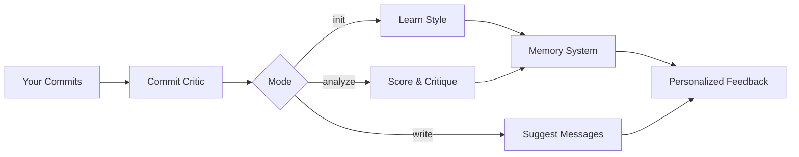
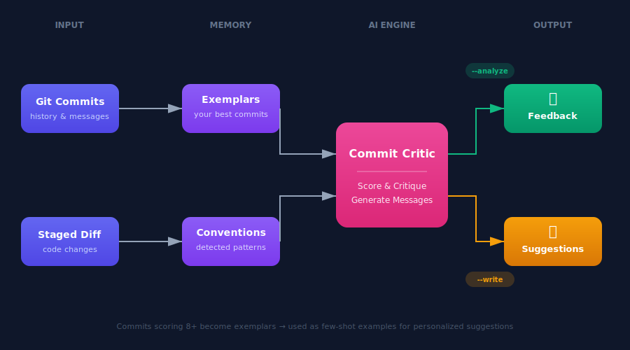

# Commit Critic

> AI-powered CLI that scores your git commits, learns your style, and helps you write better ones.

[](https://www.python.org/downloads/)
[](LICENSE)

<p align="center">
  
</p>

## What It Does

Commit Critic analyzes your git history, scores each commit message, learns from your best ones, and provides personalized suggestions—all from the command line.



## Features

| Command | What it does |
|---------|--------------|
| `critic init` | Seed memory from repository commits |
| `critic analyze` | Score commits 1-10 with personalized feedback |
| `critic write` | Generate commit messages using your best examples |
| `critic memory status` | Show what's been learned |
| `critic memory clear` | Reset memory |

**Works with:** Local repos | Remote URLs | Any git project

## Command Reference

### `critic init`
Seed memory from repository commits to learn your team's style.

```
critic init [OPTIONS]

Options:
  -u, --url TEXT       Remote Git repository URL to seed from
  -n, --count INTEGER  Number of commits to analyze [default: 100]
  --no-roasts          Skip extracting roast material
```

**Examples:**
```bash
critic init                                    # Current repo, 100 commits
critic init -n 200                             # Analyze 200 commits
critic init --url https://github.com/org/repo  # Learn from remote repo
critic init --no-roasts                        # Skip humorous roasts
```

---

### `critic analyze`
Analyze and score commit messages with personalized feedback.

```
critic analyze [OPTIONS]

Options:
  -u, --url TEXT       Remote Git repository URL to analyze
  -n, --count INTEGER  Number of commits to analyze [default: 20]
  --no-memory          Skip memory lookup for personalized feedback
```

**Examples:**
```bash
critic analyze                                    # Analyze last 20 commits
critic analyze -n 50                              # Analyze last 50 commits
critic analyze --url https://github.com/org/repo  # Analyze remote repo
critic analyze --no-memory                        # Skip personalization
```

---

### `critic write`
Suggest a commit message for your staged changes.

```
critic write [OPTIONS]

Options:
  --no-memory    Skip memory lookup for style matching
```

**Examples:**
```bash
critic write              # Suggest message for staged changes
critic write --no-memory  # Skip using learned style
```

---

### `critic memory`
Memory management commands.

```
critic memory status    # Show what's been learned
critic memory clear     # Clear all memory data
```

---

### `critic config`
Show current configuration.

```
critic config [OPTIONS]

Options:
  -s, --show    Show current configuration [default: True]
```

---

### `critic version`
Show version information.

```bash
critic version
```

## Quick Start

```bash
# Clone and install (see Installation section for details)
git clone https://github.com/Captain-Jay29/commit_critic && cd commit_critic
make setup

# Set your API key
export OPENAI_API_KEY="sk-..."

# Seed memory from your repo (learns your style)
critic init

# Analyze your last 20 commits (with personalized feedback)
critic analyze

# Get a commit message for staged changes (uses your best commits as examples)
critic write
```

## Usage

### Initialize Memory

Seed the memory system by learning from existing commits:

```bash
critic init                              # Current repo, 100 commits
critic init --url https://github.com/org/repo  # Remote repo
critic init -n 200                       # More commits
critic init --no-roasts                  # Skip humorous roasts
```

**Output:**
```
+------------------------------------------------------------------+
|  COMMIT CRITIC - LEARNING MODE                                   |
+------------------------------------------------------------------+

[1/8] Cloning repository...
      Done - Cloned tiangolo/fastapi

[2/8] Extracting commits...
      Done - Extracted 100 commits from 15 contributors

[3/8] Analyzing codebase DNA...
      - Primary: Python (94%)
      - Stack: FastAPI, Pydantic, Starlette
      - Type: Web Framework
      Done

[4/8] Detecting commit style...
      - Pattern: Conventional Commits
      - Scopes: docs, internal, feat, fix
      - No emoji
      Done - Style: conventional + scopes

[5/8] Analyzing commits...
      [================----------] 67/100
      Done - Average: 8.4/10

[6/8] Extracting exemplars...
      Done - Found 67 exemplary commits (score >= 8)

[7/8] Profiling contributors...
      - @tiangolo: 45 commits, 8.9 avg
      - @Kludex: 23 commits, 8.1 avg
      - @euri10: 12 commits, 7.8 avg
      Done - Profiled 15 contributors

[8/8] Market comparison...
      - vs flask: +0.5 better
      - vs django: -0.3 behind
      Done - Percentile: Top 15%

+------------------------------------------------------------------+
|  MEMORY SEEDED                                                   |
+------------------------------------------------------------------+

DNA: Python CLI | FastAPI + Pydantic | Conventional commits
Quality: 8.4/10 avg | 67 exemplars saved
Team: 15 contributors profiled
Market: Top 15% of Python web projects

Ready! Try: critic analyze
```

### Analyze Commits

Score commits with personalized, memory-aware feedback:

```bash
critic analyze                                    # Current repo
critic analyze -n 50                              # Last 50 commits
critic analyze --url https://github.com/org/repo  # Remote repo
```

**Output (with memory):**
```
COMMITS THAT NEED WORK

"fixed bug" (abc123) - Bob Smith
Score: 2/10
Bob, we've talked about this. This is your 15th "stuff" commit.
Your team uses conventional commits like "fix(auth): description"
Your average: 5.2 -> This commit: 2/10 (trending down)

WELL-WRITTEN COMMITS

"feat(browser): add stealth mode for automation" (def456)
Score: 9/10
Why: Clear scope, specific action, states purpose
Saved as exemplar

STATS
Average: 6.2/10 | Vague commits: 4 (20%)
```

### Write Commit Messages

Generate messages using your best commits as few-shot examples:

```bash
critic write   # Analyzes staged changes and suggests a message
```

**Output:**
```
3 files changed (+47 -12 lines)

Using 3 similar exemplars from your history...

Suggested:
fix(auth): handle token expiration gracefully

- Add error handling for expired tokens
- Implement retry logic for refresh failures
- Add test coverage for edge cases

[Enter] Accept  [e] Edit  [r] Regenerate  [q] Quit
```

### Memory Management

```bash
critic memory status   # Show what's learned
critic memory clear    # Reset memory
```

**Status Output:**
```
CODEBASE DNA
+----------------------------------------------------------------+
| Project: commit-critic                                         |
| Type: CLI Tool                                                 |
|                                                                |
| Languages:                                                     |
|   Python [====================----] 85%                        |
|   YAML   [==----------------------] 10%                        |
|                                                                |
| Stack: Python 3.11+ | Typer | OpenAI | GitPython               |
+----------------------------------------------------------------+

TEAM INSIGHTS
+----------------------------------------------------------------+
| Alice Chen (47 commits)                                        |
|   Primary: backend/auth, api/users                             |
|   Style: 8.2 avg | Consistent                                  |
|                                                                |
| Bob Smith (32 commits)                                         |
|   Primary: frontend/components                                 |
|   Style: 6.1 avg | Inconsistent                                |
+----------------------------------------------------------------+

MARKET COMPARISON
+----------------------------------------------------------------+
| Your repo vs. similar Python projects:                         |
|                                                                |
| Your average: 6.8/10                                           |
| [============--------] Better than 62%                         |
|                                                                |
| References:                                                    |
|   fastapi:  8.4/10 | django: 8.1/10 | flask: 7.9/10            |
+----------------------------------------------------------------+
```

## How It Works

<p align="center">
  
</p>

### Memory System

The memory system transforms Commit Critic from a stateless tool into a learning assistant:

| Category | Data Extracted | Used For |
|----------|---------------|----------|
| **Commit Style** | Conventional commits, emoji, tickets, scopes | Match project conventions |
| **Exemplars** | High-scoring commits (>=8) with embeddings | Few-shot examples for writer |
| **Collaborators** | Who works where, avg scores, patterns | Personalized feedback |
| **Codebase DNA** | Languages, frameworks, project type | Context-aware analysis |
| **Market Position** | Comparison to similar popular repos | Benchmarking, tips |

## Installation

```bash
# Clone the repository
git clone https://github.com/Captain-Jay29/commit_critic
cd commit_critic

# Using uv (recommended)
make setup              # Creates venv, installs deps, copies .env.example

# Or manually with uv
uv venv && uv sync --all-extras && uv pip install -e .

# Or with pip
python -m venv .venv && source .venv/bin/activate
pip install -e .
```

## Configuration

```bash
export OPENAI_API_KEY="sk-..."   # Required
critic config                    # Verify setup
critic memory status             # View learned data
critic memory clear              # Reset memory
```

## Tech Stack

- **CLI:** Python 3.11+ / Typer / Rich
- **AI:** OpenAI GPT-5.2 + Embeddings
- **Git:** GitPython
- **Storage:** SQLite

## License

MIT
