# Commit Critic

> AI-powered CLI that scores your git commits and helps you write better ones.

[](https://www.python.org/downloads/)
[](LICENSE)

<p align="center">
  <i>🎬 Cool demo coming soon!</i>
</p>

## What It Does

Commit Critic analyzes your git history, scores each commit message, and learns from your best ones to suggest improvements—all from the command line.

```mermaid
flowchart LR
    A[Your Commits] --> B[Commit Critic]
    B --> C{Mode}
    C -->|analyze| D[Score & Critique]
    C -->|write| E[Suggest Messages]
    D --> F[📊 Actionable Feedback]
    E --> G[💡 Context-Aware Suggestions]
```



## Features

| Mode | What it does |
|------|--------------|
| `--analyze` | Score commits 1-10 with specific feedback |
| `--write` | Generate commit messages from staged changes |
| `--init` | Learn your style from existing commits |

**Works with:** Local repos • Remote URLs • Any git project

## Quick Start

```bash
# Install
pip install commit-critic

# Set your API key
export OPENAI_API_KEY="sk-..."

# Analyze your last 20 commits
critic --analyze

# Get a commit message for staged changes
critic --write
```

## Usage Examples

### Analyze Commits

```bash
critic --analyze                                    # Current repo
critic --analyze -n 50                              # Last 50 commits
critic --analyze --url https://github.com/org/repo  # Remote repo
```

**Output:**
```
📊 Analyzing last 20 commits...

💩 NEEDS WORK
   "fixed bug" (abc123) — 2/10
   → Too vague. Try: "fix(auth): resolve token expiration handling"

✨ WELL WRITTEN  
   "feat(browser): add stealth mode for automation" (def456) — 9/10
   → Clear scope, specific action, states purpose

📈 Average: 6.2/10 | Vague commits: 4 (20%)
```

### Write Commit Messages

```bash
critic --write   # Analyzes staged changes and suggests a message
```

**Output:**
```
🔍 3 files changed (+47 -12 lines)

💡 Suggested:
┌──────────────────────────────────────────────────
│ fix(auth): handle token expiration gracefully
│
│ - Add error handling for expired tokens
│ - Implement retry logic for refresh failures  
│ - Add test coverage for edge cases
└──────────────────────────────────────────────────

[Enter] Accept  [e] Edit  [r] Regenerate  [q] Quit
```

## How It Works

<p align="center">
  
</p>

**Memory System:** Commits scoring 8+ are saved as exemplars. When writing new messages, your own best commits are used as few-shot examples for personalized suggestions.

## Installation

```bash
# pip
pip install commit-critic

# uv (recommended)
uv pip install commit-critic

# From source
git clone https://github.com/jay/commit-critic
cd commit-critic && pip install -e .
```

## Configuration

```bash
export OPENAI_API_KEY="sk-..."   # Required
critic config                    # Verify setup
critic memory show               # View stored exemplars
critic memory clear              # Reset memory
```

## Tech Stack

- **CLI:** Python 3.11+ / Typer / Rich
- **AI:** OpenAI GPT-5.2 + Embeddings
- **Git:** GitPython
- **Storage:** SQLite

## License

MIT
